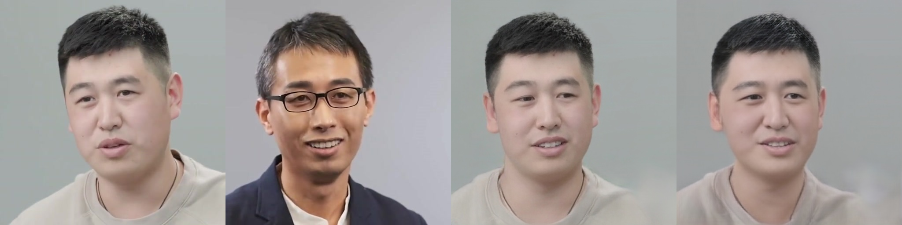

# LivePortrait Training Implementation

> An unofficial training implementation of LivePortrait. This is currently a basic version that is not fully implemented and may contain bugs. Please use with caution.

## Demo Results



The image above shows a comparison between:
- Source image (leftmost)
- Target image (second from left) 
- Official LivePortrait results (second from right)
- This repository's results (rightmost, training from scratch)


## Project Status

### ✅ Completed Features
- Stage 1 Training Implementation
- PyTorch Lightning Integration  
- Basic GAN Architecture
- VGG-based Perceptual Loss (Cascaded)
- Wing Loss (under testing)

With these completed components, you can train a basic version of LivePortrait Stage 1.

### 🚧 Work in Progress
- GAN Cascade Loss Implementation
- Stage 2 & 3 Implementation

## Implementation Details

### Keypoint Configuration
Since the original LivePortrait paper did not disclose the specific 10 keypoints used, we currently use the following configuration:

**Eye Region (6 points)**
- Left Eye:
  - Outer corner (36)
  - Inner corner (39) 
  - Upper eyelid midpoint (37)
- Right Eye:
  - Outer corner (42)
  - Inner corner (45)
  - Upper eyelid midpoint (43)

**Mouth Region (4 points)**
- Left corner (48)
- Right corner (54)
- Upper lip midpoint (51) 
- Lower lip midpoint (57)

## Usage

The repository contains two main scripts:

### `Train.py`
Training script for Stage 1 implementation

```
python train.py \
    --batch_size 8 \
    --val_batch_size 4 \
    --lr_g 1e-4 \
    --lr_d 4e-4 \
    --exp_name "exp_wingloss" \
    --exp_dir "./exps/exps3/" \
    --cache_dir "./assets/db_cache/" \
    --vgg_loss_weight 1.0 \
    --gan_loss_weight 0.1 \
    --prior_loss_weight 1.0 \
    --deformation_loss_weight 1.0 \
    --headpose_loss_weight 1.0 \
    --equivariance_loss_weight 1.0 \
    --every_n_epochs 1 \
    --recon_loss_weight 10.0 \
    --pretrained_mode 0 \
    --checkpoint_path "" \
    --max_epochs 1000 \
    --debug_mode False \
    --wandb_mode True \
    --clip_grad_norm 1.0 \
    --wing_loss_omega 10 \
    --wing_loss_epsilon 2 \
    --landmark_selected_index "36,39,37,42,45,43,48,54,51,57"
```

### `Test.py` 
Inference script that generates the following output sequence:
1. Source image
2. Driving image  
3. Official LivePortrait model output
4. Your trained model output

> Note: Due to certain constraints, pre-trained models are not available for release at this time.

## References
- [Official LivePortrait Repository](https://github.com/KwaiVGI/LivePortrait)
- [Face-vid2vid](https://github.com/zhengkw18/face-vid2vid)
- [LIA](https://github.com/wyhsirius/LIA)
- [Wing Loss](https://github.com/elliottzheng/AdaptiveWingLoss/blob/master/wing_loss.py)